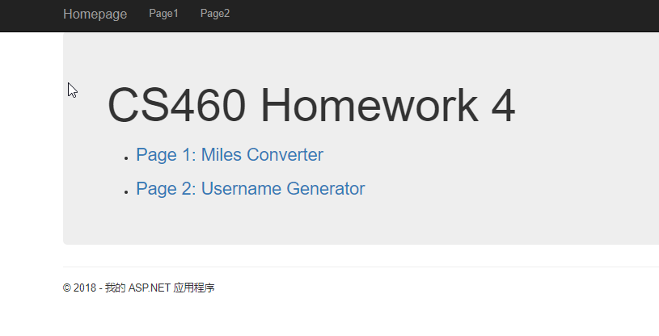
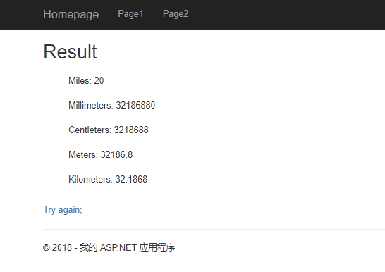
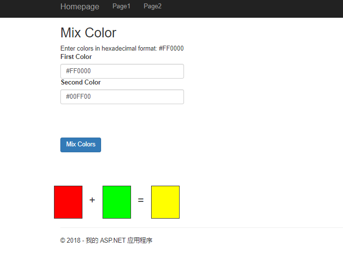

[Repo](https://github.com/klyu521/klyu521.github.io)
### Start doing Miles converter
First I create a new ASP.NET MVC framework, and I create new controller called Converter。 Then I consider how to impile it, I think I use a hard way to do it, beacause when I wreite code I found the code is complex. I extract the data within a controller action method by using the Request object.
```
using System;
using System.Collections.Generic;
using System.Linq;
using System.Web;
using System.Web.Mvc;

namespace homework4.Controllers
{
    public class ConverterController : Controller
    {
        // GET: Converter
        [HttpGet]
       
        public ActionResult Converter()
        { 
            string num = Request.QueryString["num"];
            string type = Request.QueryString["type"];

            ViewBag.num = num;
            ViewBag.type = type;
```
Then I create a new view called converter.
```
@{
    ViewBag.Title = "Converter";
}

<h2>Miles Converter</h2>

<form method="get">
    <label for="num">Miles to Convert</label><br />
    <input type="number" name="num" value="" /><br /><br />
    <label for="type">From:</label><br />
    <input type="radio" name="type" value="aMiles" checked />Miles <br />
    <input type="radio" name="type" value="bMillimeters" /> Millimeters <br />
    <input type="radio" name="type" value="cCentieters" /> Centieters <br />
    <input type="radio" name="type" value="dMeters" /> Meters <br />
    <input type="radio" name="type" value="eKilometers" /> Kilometers <br /><br />
    <input type="submit" value="Convert" />
</form>
```
Next I start to do the method in the conroller, I use ViewBag to assign values of each type, and retrun the view called result that I create later. It is a simple caluation so that the code is long. I just cut a piece of the whole code.
```
 if (!String.IsNullOrEmpty(num))
            {
                if (type.StartsWith("a"))
                {
                    ViewBag.a = Convert.ToDouble(num);
                    ViewBag.b = ViewBag.a * 1609344;
                    ViewBag.c = ViewBag.a * 160934.4;
                    ViewBag.d = ViewBag.a * 1609.34;
                    ViewBag.e = ViewBag.a * 1.60934;
                    return View("Result");
                }

                else if (type[0] == 'b')
                {
                    ViewBag.b = Convert.ToDouble(num);
                    ViewBag.a = ViewBag.d * 0.00062;
                    ViewBag.c = ViewBag.b * 0.1;
                    ViewBag.d = ViewBag.b * 0.001;
                    ViewBag.e = ViewBag.b * 0.000001;
                    return View("Result");
                }
```
Then it is Result view, I create a new view and show all the reult of each type. And I set a link 'Try Again' so that you can go back  to Converter view.

```
@{
    ViewBag.Title = "Result";
}

<h2>Result</h2>

<ul style="list-style:none;">
    <li style="margin-top:20px;">Miles: @ViewBag.a</li>
    <li style="margin-top:20px;">Millimeters: @ViewBag.b</li>
    <li style="margin-top:20px;">Centieters: @ViewBag.c</li>
    <li style="margin-top:20px;">Meters: @ViewBag.d</li>
    <li style="margin-top:20px;"> Kilometers: @ViewBag.e</li>
</ul>
<br />
@Html.ActionLink("Try again", "Converter");
```
When I finished this part, the most part of Miles Converter has benn done.


### Start doing Page 2

Page 2 is about a color chooser, I google how to use the ColorTranslator and convert the color to html format. Then I create a new controller called color chooser, and calcuate the value for the new color. Using ViewBag to assin value of Result.
```
public class ColorchooserController : Controller
    {
        // GET: Colorchooser
        
        public ActionResult Mix()
        {
            return View();
        }

        [HttpPost]
        public ActionResult Mix(string firstColor, string secondColor)
        {
           
            // Convert colors to Color object
            Color firstRgb = ColorTranslator.FromHtml(firstColor);
            Color secondRgb = ColorTranslator.FromHtml(secondColor);

            // Define red, grenn, blue to calcuate 
            int red = LimitValue(firstRgb.R, secondRgb.R);
            int green =LimitValue(firstRgb.G, secondRgb.G);
            int blue = LimitValue(firstRgb.B, secondRgb.B);

            // Use values to calculate the result
            Color newColor = Color.FromArgb(red, green, blue);
             string Result = ColorTranslator.ToHtml(newColor);

            // Use ViewBag with three colors
            ViewBag.ColorOne = "background:" + firstColor;
            ViewBag.ColorTwo = "background:" + secondColor;
            ViewBag.ColorThree = "background:" + Result;

            return View();
        }
 ```
 Then I start the view part of 'Mix' which is showing the output of the color chooser.
 ```
 @if (ViewBag.ColorOne != null)
{
    <div class="row">
        <div class="col-sm-1" style="width:65px; height:75px; @ViewBag.ColorOne; border-style:solid; border-width:1px"></div>
        <div class="col-sm-1" style="width:45px;"><h3>+</h3></div>
        <div class="col-sm-1" style="width:65px; height:75px; @ViewBag.ColorTwo; border-style:solid; border-width:1px"></div>
        <div class="col-sm-1" style="width:45px;"><h3>=</h3></div>
        <div class="col-sm-1" style="width:65px; height:75px; @ViewBag.ColorThree; border-style:solid; border-width:1px"></div>
    </div>
}
```
### Create links in homepage.
```
    
<p>
  

    <ul id="homepage-list">
        <li>
            <h3>@Html.ActionLink("Page 1: Miles Converter", "Converter", "Converter")</h3>
        </li>
        <li>
            <h3>@Html.ActionLink("Page 2: Username Generator", "Mix", "Colorchooser")</h3>
        </li>
    </ul>
</p>
```
Then I change the Navigation bar for Page 1, Page 2.
```
<body>
    <div class="navbar navbar-inverse navbar-fixed-top">
        <div class="container">
            <div class="navbar-header">
                <button type="button" class="navbar-toggle" data-toggle="collapse" data-target=".navbar-collapse">
                    <span class="icon-bar"></span>
                    <span class="icon-bar"></span>
                    <span class="icon-bar"></span>
                </button>
                @Html.ActionLink("Homepage", "Index", "Home", new { area = "" }, new { @class = "navbar-brand" })
            </div>
            <div class="navbar-collapse collapse">
                <ul class="nav navbar-nav">
                    <li>@Html.ActionLink("Page1", "Converter", "Converter")</li>
                    <li>@Html.ActionLink("Page2", "Mix", "Colorchooser")</li>
                  
                </ul>
            </div>
        </div>
    </div>
```
### Screenpriint of my program.




