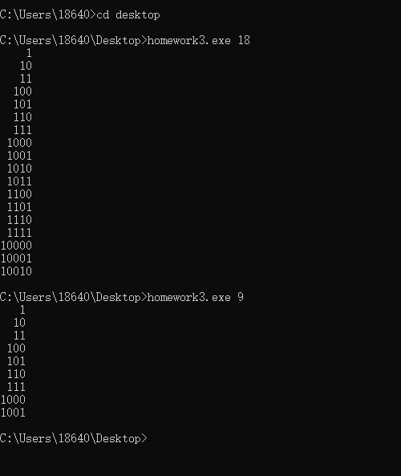

### Homework 3

### Setting Up Visual Studio
First, I install the Visual Studio 2017 in my computer and I create a new folder calld 'hw3'. And I create a new branch 'hw3'to start my work.
```
mkdir hw3
cd hw3
git branch hw3 
git checkout hw3
```
Then I find a ```.gitignore``` file on github, I download this file and put it into hw3 file then I push it to remote origin.
```
git add .gitignore
git commit -m "hw3"
git checkout master
git merge hw3
git push -u origin master
```
### Run the JAVA Program
I download the java code and run it in Eclipse, I run the program, it is a simple example of Breadth-First Search to enumeration of states problems.
### Start to convert
First I read the Main.java so that I can know what class and data structure I need to da. Then I start to convert the Node.java, it is almost same between C# an java in this part.
```
using System;
/// <summary>
/// Singly linked node class. </summary>

public class Node<T>
{
	public T data;
	public Node<T> next;

	public Node(T data, Node<T> next)
	{
		this.data = data;
		this.next = next;
	}
}
```
Then I check the QueueInterface.java, and convert it.
```
using System;
/// <summary>
/// A FIFO queue interface.  
/// linked queue.
/// </summary>
public interface IQueueInterface<T>
{
	/// <summary>
	/// Add an element to the rear of the queue
	/// </summary>
	/// <returns> the element that was enqueued </returns>
	T Push(T element);

	/// <summary>
	/// Remove and return the front element.
	/// </summary>
	/// <exception cref="Thrown"> if the queue is empty </exception>
//JAVA TO C# CONVERTER WARNING: Method 'throws' clauses are not available in .NET:
//ORIGINAL LINE: T pop() throws QueueUnderflowException;
	T Pop();

	/// <summary>
	/// Test if the queue is empty
	/// </summary>
	/// <returns> true if the queue is empty; otherwise false </returns>
	bool Empty {get;}
}
```
It is a little difference about this part, this is a interface so I write IQueueInterface<T> and rename this file to  IQueueInterface and I write the Pop and Push.
Next I start to convert QueueUnderflowException.java, I use base keyword to invoke and it match super in java.
  ```
  using System;

/// <summary>
/// A custom unchecked exception to represent situations where 
/// an illegal operation was performed on an empty queue.
/// </summary>
public class QueueUnderflowException : Exception
{
  public QueueUnderflowException() : base()
  {
  }

  public QueueUnderflowException(string message) : base(message)
  {
  }
}
```
In the part of LinkedQueue.java, I meet some problems, I search a lot of references to figure out how to implement LinkedQueue in C#. 
```
public class LinkedQueue<T> : IQueueInterface<T>
{
	private Node<T> front;
	private Node<T> rear;

	public LinkedQueue()
	{
		front = null;
		rear = null;
	}

	public virtual T Push(T element)
	{
		if (object.Equals(element, default(T)))

        {
			throw new System.NullReferenceException();
		}

		if (Empty)
		{
			Node<T> tmp = new Node<T>(element, null);
			rear = front = tmp;
		}
		else
		{
			// General case
			Node<T> tmp = new Node<T>(element, null);
			rear.next = tmp;
			rear = tmp;
		}
		return element;
	}

	public virtual T Pop()
	{
		T tmp = default;
		if (Empty)
		{
			throw new QueueUnderflowException("The queue was empty when pop was invoked.");
		}
		else if (front == rear)
		{ // one item in queue
			tmp = front.data;
			front = null;
			rear = null;
		}
		else
		{
			// General case
			tmp = front.data;
			front = front.next;
		}

		return tmp;
	}

	public virtual bool Empty
	{
		get
		{
			if (front == null && rear == null)
			{
				return true;
			}
			else
			{
				return false;
			}
		}
	}

}
```
In the Main.java, there is a error about class name, so I change the class name to Binary and rename this file. I convert ``System.println to ```Console.Writeline. And I convert onditional statement to the C# rules.
```
using System;
using System.Collections.Generic;
using System.Text;
using System.Linq;


namespace HW3
{

    public class Binary
    {
        /// <summary>
        /// Print the binary representation of all numbers from 1 up to n.
        /// This is accomplished by using a FIFO queue to perform a level 
        /// order (i.e. BFS) traversal of a virtual binary tree that 
        /// looks like this:
        ///                 1
        ///             /       \
        ///            10       11
        ///           /  \     /  \
        ///         100  101  110  111
        ///          etc.
        /// and then storing each "value" in a list as it is "visited".
        /// </summary>
        internal static LinkedList<string> GenerateBinaryRepresentationList(int n)
        {
            // Create an empty queue of strings with which to perform the traversal
            LinkedQueue<StringBuilder> q = new LinkedQueue<StringBuilder>();

            // A list for returning the binary values
            LinkedList<string> output = new LinkedList<string>();

            if (n < 1)
            {
                // binary representation of negative values is not supported
                // return an empty list
                return output;
            }

            // Enqueue the first binary number.  Use a dynamic string to avoid string concat
            q.Push(new StringBuilder("1"));

            // BFS 
            while (n-- > 0)
            {
                // print the front of queue 
                StringBuilder sb = q.Pop();
                output.AddLast(sb.ToString());

                // Make a copy
                StringBuilder sbc = new StringBuilder(sb.ToString());

                // Left child
                sb.Append('0');
                q.Push(sb);
                // Right child
                sbc.Append('1');
                q.Push(sbc);
            }
            return output;
        }

        // Driver program to test above function 
        public static void Main(string[] args)
        {
            int n = 10;
            if (args.Length < 1)
            {
                Console.WriteLine("Please invoke with the max value to print binary up to, like this:");
                Console.WriteLine("\tc# Main 12");
                return;
            }
            try
            {
                n = int.Parse(args[0]);
            }
            catch (System.FormatException)
            {
                Console.WriteLine("I'm sorry, I can't understand the number: " + args[0]);
                return;
            }
            LinkedList<string> output = GenerateBinaryRepresentationList(n);
            // Print it right justified.  Longest string is the last one.
            // Print enough spaces to move it over the correct distance

            int maxLength = output.Last.Value.Length;

            foreach (string s in output)
            {
                for (int i = 0; i < maxLength - s.Length; ++i)
                {
                    Console.Write(" ");
                }
                Console.WriteLine(s);
            }
        }
    }
}
```

### Run the program in Command line




### Merge hw3 and push all files to remote origin

```
git checkout hw3
git add *
git commit -m "hw3"
git checkout master
git merge hw3
git push -u origin master
```
