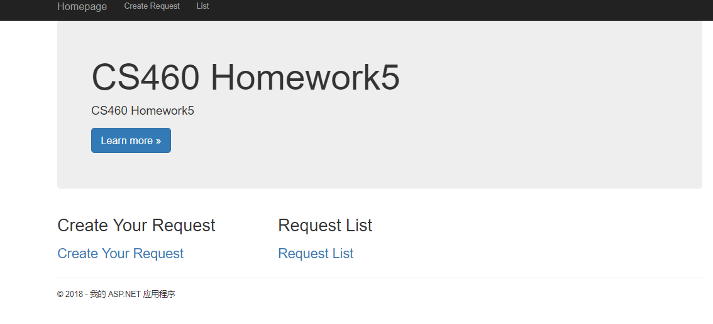
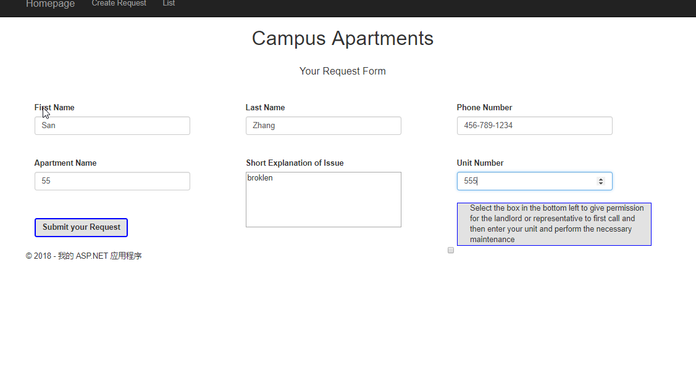
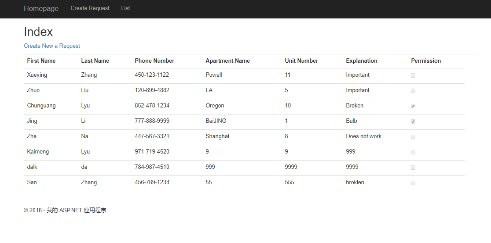

### Homework 5
## [Repo](https://github.com/klyu521/klyu521.github.io)

### Start doing the new project.
First, i created a new empty MVC application, and added my .gitignore file to the base directory of the project. Then I start to do the part of Database, becasuse it based on the homework4 and I need build a database.
At the beginning, I create up.sql and down.sql files to build database.
```
CREATE TABLE [dbo].[Requests]
(
	[ID]			INT IDENTITY (1,1)	NOT NULL,
	[FirstName]		NVARCHAR(20)		NOT NULL,
	[LastName]		NVARCHAR(20)		NOT NULL,
	[PhoneNumber]	NVARCHAR(12)		NOT NULL,
	[ApartmentName]	NVARCHAR(30)		NOT NULL,
	[UnitNumber]	INT					NOT NULL,
	[Explanation]	NVARCHAR(60)		NOT NULL,
	[Permission]	BIT					NOT NULL,
	CONSTRAINT [PK_dbo.Requests] PRIMARY KEY CLUSTERED ([ID] ASC)
);

INSERT INTO [dbo].[Requests] (FirstName, LastName, PhoneNumber, ApartmentName, UnitNumber, Explanation, Permission) VALUES
	('Xueying', 'Zhang', '450-123-1122', 'Powell', 11, 'Important', 0),
	('Zhuo', 'Liu', '120-899-4882', 'LA', 5, 'Important', 0),
	('Chunguang', 'Lyu', '852-478-1234', 'Oregon', 10, ' Broken', 1),
	('Jing', 'Li', '777-888-9999', 'Bejing', 1, 'Bulb', 1),
	('Zha', 'Na', '447-567-3321', 'Shanghai', 8, 'Does not work', 0)
GO
```
down.sql
```
DROP TABLE [dbo].[Requests];
```
### Create the Data Model Class and Data Context Class
I follow the note in class to create the Context Class. Context is what will allow the data in the model to interact with the controller and view, and I snstall the Entity Framework.
```
using HW5.Models;
using System;
using System.Collections.Generic;
using System.Data.Entity;
using System.Linq;
using System.Web;

namespace HW5.DAL
{
    public class RequestsContext :  DbContext
    {
        public RequestsContext() : base("name=Requests") { }
        public virtual DbSet<Requests> Requests { get; set; }
    }
}
```
Then I Create the data model.
```
 namespace HW5.Models
{
    public class Requests
    {
        /// <summary>
        /// The automatically generated ID in the database. This is the PRIMARY KEY.
        /// </summary>
        [Key]
        public int ID { get; set; }


        [Required]
        [Display(Name = "First Name")]
        public string FirstName { get; set; }
     
        [Required]
        [Display(Name = "Last Name")]
        public string LastName { get; set; }
        
        [Required]
        [Display(Name = "Phone Number")]
        public string PhoneNumber { get; set; }
       
        [Required]
        [Display(Name = "Apartment Name")]
        public string ApartmentName { get; set; }
      
        [Required]
        [Display(Name = "Unit Number")]
        public int UnitNumber { get; set; }
        
        [Required(ErrorMessage = "Explanation"), StringLength(80, ErrorMessage = "Input can be less than 80 Characters")] 
        public string Explanation { get; set; }

        [Required]
        public bool Permission { get; set; }

        public override string ToString()
        {
            return $"{base.ToString()}: {FirstName} {LastName} {PhoneNumber} {ApartmentName} UnitNumber = {UnitNumber} {Explanation} Permission = {Permission}";
        }
    }
}
```
###  Connecting to the Database
I find the Web.confign file and use <ConnectionStrings> to connet the database.
```
  <configSections>
    <!-- For more information on Entity Framework configuration, visit http://go.microsoft.com/fwlink/?LinkID=237468 -->
    <section name="entityFramework" type="System.Data.Entity.Internal.ConfigFile.EntityFrameworkSection, EntityFramework, Version=6.0.0.0, Culture=neutral, PublicKeyToken=b77a5c561934e089" requirePermission="false" />
  </configSections>
  <connectionStrings>
    <add name="Requests"
         connectionString="Data Source=(LocalDB)\MSSQLLocalDB;AttachDbFilename=C:\Users\18640\source\repos\HW5\HW5\App_Data\Requests.mdf;Integrated Security=True"
         providerName="System.Data.SqlClient"/>
  </connectionStrings>
```

### Create the controller and view
I create a new controller called Request, and use [HttpPost] to post Requests.
```
public class RequestController : Controller

        {
            private RequestsContext db = new RequestsContext();

            // GET: Requests
            public ActionResult Index()
            {
                return View(db.Requests.ToList());
            }


            // GET: Requests
            public ActionResult Requests()
            {
                return View();
            }

            // POST Requests
            [HttpPost]
            public ActionResult Requests(Requests requests)
            {
                if (ModelState.IsValid)
                {
                //Add new request to the database
                    db.Requests.Add(requests);
                    db.SaveChanges();
                    return RedirectToAction("Index");
                }
                //Return the requests
                return View(requests);
            }
        }
    }
```
Next I create 2 views, one is the page that user can create a new request form, another is the page of listing all requestes. I use some Razorform helpers to build the form that is used to create the entries in the database.
```
@using (Html.BeginForm())
{
    @Html.AntiForgeryToken()

    <div class="form-horizontal">

        @Html.ValidationSummary(true, "", new { @class = "text-danger" })

        <div class="col-md-6">
            @Html.LabelFor(model => model.FirstName, "First Name")
            @Html.EditorFor(model => model.FirstName, new { htmlAttributes = new { @class = "form-control" } })
            @Html.ValidationMessageFor(model => model.FirstName, "", new { @class = "text-danger" })
        </div>

        <div class="col-md-6">
            @Html.LabelFor(model => model.LastName, "Last Name")
            @Html.EditorFor(model => model.LastName, new { htmlAttributes = new { @class = "form-control" } })
            @Html.ValidationMessageFor(model => model.LastName, "", new { @class = "text-danger" })
        </div>
        <div class="col-md-6">
            @Html.LabelFor(model => model.PhoneNumber, "Phone Number")
            @Html.EditorFor(model => model.PhoneNumber, new { htmlAttributes = new { @class = "form-control" } })
            @Html.ValidationMessageFor(model => model.PhoneNumber, "", new { @class = "text-danger" })
        </div>
    </div>


    <div class="form-group" style="padding-top:100px;">

        <div class="col-md-6">
            @Html.LabelFor(model => model.ApartmentName, "Apartment Name")
            @Html.EditorFor(model => model.ApartmentName, new { htmlAttributes = new { @class = "form-control" } })
            @Html.ValidationMessageFor(model => model.ApartmentName, "", new { @class = "text-danger" })
        </div>
        <div class="col-md-12">
            @Html.LabelFor(model => model.Explanation, "Short Explanation of Issue")
            @Html.TextAreaFor(model => model.Explanation,
     new { @cols = "100", @rows = "5", @style = "width:100%; resize:none;"})
            @Html.ValidationMessageFor(model => model.Explanation, "", new { @class = "text-danger" })
        </div>
        <div class="col-md-6">
            @Html.LabelFor(model => model.UnitNumber, "Unit Number")
            @Html.EditorFor(model => model.UnitNumber, new { htmlAttributes = new { @class = "form-control" } })
            @Html.ValidationMessageFor(model => model.UnitNumber, "", new { @class = "text-danger" })
        </div>

    </div>
```
```
@model IEnumerable<HW5.Models.Requests>

@{
    ViewBag.Title = "Requests List";
}

<h2>Index</h2>

<p>
    @Html.ActionLink("Create New a Request", "Requests")
</p>
<table class="table">
    <tr>
        <th>
            @Html.DisplayNameFor(model => model.FirstName)
        </th>
        <th>
            @Html.DisplayNameFor(model => model.LastName)
        </th>
        <th>
            @Html.DisplayNameFor(model => model.PhoneNumber)
        </th>
        <th>
            @Html.DisplayNameFor(model => model.ApartmentName)
        </th>
        <th>
            @Html.DisplayNameFor(model => model.UnitNumber)
        </th>
        <th>
            @Html.DisplayNameFor(model => model.Explanation)
        </th>
        <th>
            @Html.DisplayNameFor(model => model.Permission)
        </th>
        <th></th>
    </tr>

@foreach (var item in Model) {
    <tr>
        <td>
            @Html.DisplayFor(modelItem => item.FirstName)
        </td>
        <td>
            @Html.DisplayFor(modelItem => item.LastName)
        </td>
        <td>
            @Html.DisplayFor(modelItem => item.PhoneNumber)
        </td>
        <td>
            @Html.DisplayFor(modelItem => item.ApartmentName)
        </td>
        <td>
            @Html.DisplayFor(modelItem => item.UnitNumber)
        </td>
        <td>
            @Html.DisplayFor(modelItem => item.Explanation)
        </td>
        <td>
            @Html.DisplayFor(modelItem => item.Permission)
        </td>
        
    </tr>
}

</table>
```

### Run the prohect.
I create the link to my views and fix the Navigation bar.




