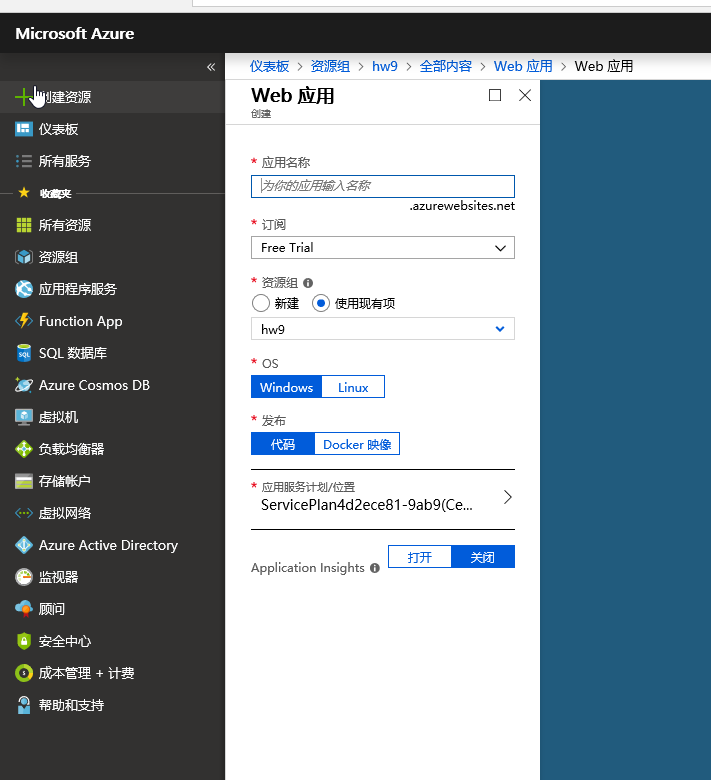

### [Repo](https://github.com/klyu521/klyu521.github.io)

### Create a new Resource group

 First I create a new resource group.
 
### Create a new SQL Database and server 

"Blank database" for Select source.
Create a Server admin login and password.
Allow Azure services to access server. 

### Set Firewall Rule 
Select the SQL Sever that I created, and the Start/End IP that matches the Client IP address.

### Create Databse to SSMS and use up.sql
Copy the Server name and use the password to log.
Use up.sql to update the Databse.
In Visual Studio, select the Server Explorer, and right click SQL Databases Under Azure, and select "Open SQL Server Object Explorer", 
then select the "Add SQL Server" option.

### Connection String
 Get the connection string and put it in the Web.config, delete the old connection string.
 
 
 
 ### Create the Web App
 
 
 ### Configure Connection String
 For the Connection String input, it must match the name of the context class.
 The Value input must be the same string that was plugged into Web.Config
 Type is SQLServer
 
 
 ### Deploy Web App to Azure
  Select the App Service, and select From Exisiting.
  

### [Video](https://www.youtube.com/watch?v=Ren0Ekuuug4&feature=youtu.be)
